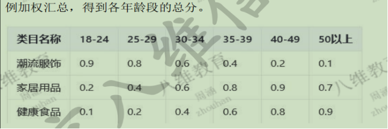
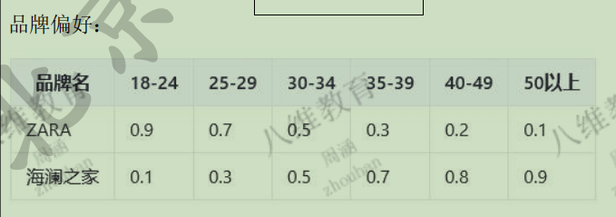
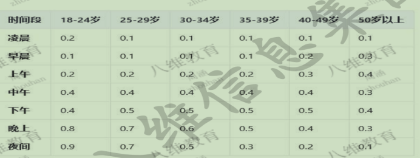
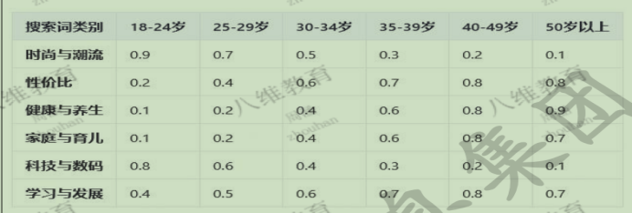
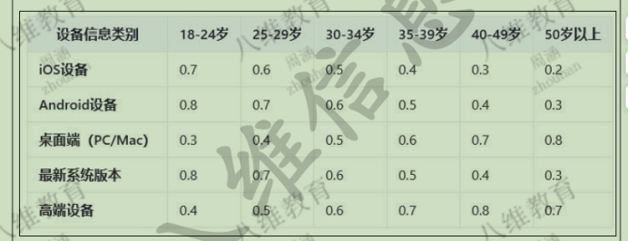

>字段

年龄、性别、年代、身高、体重、星座，

行为	yes	日志	actions.favor_add

品牌	yes	base_reademark.id

类别	yes	sku_info.category3_id

价格	yes	order_info.original_total_amount

时间	yes	order_info.create_time

搜索词	yes	日志数据

社交	no

设备	yes	日志	common.md
>标签

用户年龄标签
淘宝平台用户行为日志数据（包括但不限于点击、浏览、搜索、 收藏、加购、下单、支付、商品评价等）对用户近期行为涉及的所有类目，按比例加权汇总，得到各年龄段的总分

时间行为：

凌晨：00:00 - 05:59
早晨：06:00 - 08:59
上午：09:00 - 11:59
中午：12:00 - 13:59
下午：14:00 - 17:59
晚上：18:00 - 21:59
夜间：22:00 - 23:59

搜索词分析：

时尚与潮流：“潮流”、“新款”、“时尚”等。
性价比：“优惠”、“折扣”、“便宜”等。
健康与养生：“健康食品”、“保健品”、“养生”等。
家庭与育儿：“婴儿用品”、“儿童玩具”、“亲子活动”等。
科技与数码：“智能手机”、“电脑配件”、“智能设备”等。
学习与发展：“在线课程”、“书籍”、“技能提升”等、
设备信息：

用户体重	no
用户性别	yes
女性用户：以女性相关品类购买行为为主。
男性用户：以男性相关品类购买行为为主。
用户身高	no
星座	yes	提取月份（`month`）和日期（`day`）
摩羯座（12 月 22 日～1 月 19 日）
水瓶座（1 月 20 日～2 月 18 日）
双鱼座（2 月 19 日～3 月 20 日）
白羊座（3 月 21 日～4 月 19 日）
金牛座（4 月 20 日～5 月 20 日）
双子座（5 月 21 日～6 月 21 日）
巨蟹座（6 月 22 日～7 月 22 日）
狮子座（7 月 23 日～8 月 22 日）
处女座（8 月 23 日～9 月 22 日）
天秤座（9 月 23 日～10 月 23 日）
天蝎座（10 月 24 日～11 月 22 日）
射手座（11 月 23 日～12 月 21 日）

>流程

Ods层：使用flinkcdc采集业务数据放进kafka，日志数据同样放进kafka
Dwd层：对日志数据进行分流，分出页面，错误，启动，动作，曝光信息发送kafka
Dws层：对日志进行关联，计算各个指标，将结果放进doris中
Ads层：finerepotr大屏效果

>可以优化点